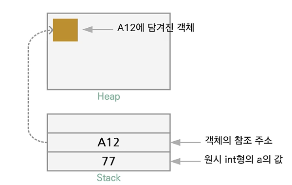
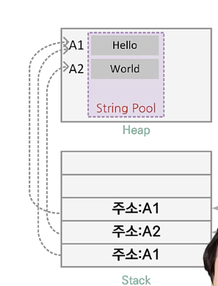

# 코틀린 프로그래밍 기본

## 1장. 코틀린이란 무엇일까?

### 코틀린의 특징 및 장점

1. 자료형에 대한 오류를 미리 잡을 수 있는 정적 언어

   - 정적 형식 : 컴파일러가 타입을 검증해 줌

2. 널 포인터로 인한 프로그램의 중단을 예방

   - NPE에서 자유롭다.
   - NPE는 Null Pointer Exception

3. 데이터 선언 시 널 가능한 형식과 불가능한 형식 지원

4. 자바와 완벽하게 상호운영 가능

   

-------


## 2장. 변수와 자료형, 연산자

### 자료형과 변수

#### 변수

- val (value) : 불변형 - 값 변경 불가
  - 예시: ```val username : String = "value"```
- var (variable) : 가변형

#### 변수 선언

- ```val username = "cho hee"``` : 자료형을 추론하여 String으로 결정
- ```var username``` : 자료형을 지정하지 않은 변수는 사용할 수 없음
- ```val init : int``` : 사용전 혹은 생성자 시점에서 init 변수를 초기화 해야 함
- ```val num = 10``` : num 은 int형으로 추론 


#### 자료형

- 기본형 (Primitive data type)

  - 가공되지 않은 순수한 자료형으로 프로그래밍 언어에 내장
  - 직접 데이터를 다룸
  - int, long, float, double 등

- 참조형 (Reference type)

  - 동적 메모리 공간에 데이터를 둔 다음 이것을 참조하는 자료형
  - 객체로 참조하는 타입, 즉 특정 주소 참조 
  - Int, Long, Float, Double 등

- 자바의 기본형과 참조형의 원리

  - 

  - ```java
    int a = 77; //기본형
    Person p = new Person(); // 객체 참조형으로 person 객체를 위해 참조 주소(A12)를 가진다.
    ```

  - a는 직접 Stack(임시)에 접근한다. 
  - p는 동적 공간(Heap-프로그램이 실행될 때 메모리에 잡힘)에 생성되고, Stack에 있는 주소로 참조함

- 자료형 예시

  ```kotlin
  // 부호 있는 정수 자료형
  val num1 = 123L // Long형으로 추론
  val num2 = 0x0F // 0x를 사용해 16진 표기가 사용된 int형으로 추론
  val num3 = 0b00001011 // 0b를 사용해 2진 표기가 된 int형으로 추론
  
  // 부호 없는 정수 자료형
  val uint :UInt =123u
  val ushort :UShort =1234u
  
  //큰 수를 읽기 쉽게 하는 방법 : _를 포함해 표현
  val number = 1_000_000
  val cardNum = 1234_1234_1234_1234L
  
  
  ```

#### 자료형의 최소 최대

- 자료형의 최소 최대 
- 음수는 2의 보수 표현을 사용해서 연산 (컴퓨터 내부적으로)
  - 2의 보수 :절댓값의 이진수에 값을 더하고 1을 더함
  - 덧셈(가산기)회로만으로 뺄셈을 표현할 수 있기 때문 

#### 문자열

- String으로 선언되며 String Pool이라는 공간에 구성 (배열같음)

- JVM 메모리 공간을 따르며, 아래 그림과 같이 Heap에 String Pool을 생성하고 문자열은 String pool에 들어감

- 문자열은 들어가면 바꿀 수 없는 불변형임 (var로 선언할지라도!)

  - 즉, var로 선언된 str의 참조 주소는 가변형으로 바뀔 수 있지만 (다른 주소로 지정 가능)
  - 일단 선언되 생성된 메모리 공간의 Hello는 변경되지 않음

  ```kotlin
  fun main(){
    var str1 : String = "Hello"
    var str2 = "world"
    var str3 = "Hello" // 새로운 공간을 사용하는 것이 아니라 str1과 뚁같은 공간을 가리킴
    print("str1===str2: ${str1===str2}") //=== 는 참조비교, False
    print("str1===str3: ${str1===str3}") //=== 는 참조비교, True
  }
  ```

  

### null을 허용한 변수 검사

- 코틀린의 변수 선언은 기본적으로 null 허용하지 않음

- null 가능한 선언
  - Nullable 표현에 ? 사용
  -  ```val a: Int? = null```

- NPE (Null Pointer Exception) : 사용할 수 없는 null인 변수에 접근하면서 발생하는 예외

#### Safe call(?)과 non-null(!!) 단정 기호 활용

```kotlin
var str: String?
str = null
print("str1: $str, len: ${str?.length}") // ? (safe call) : null이면 뒷 부분 실행안함 
print("str1: $str, len: ${str!!.length}") // !! : null일리 없다고 가정함
```

#### 엘비스 연산자

```kotlin
var str: String?
str = null
val len1 = if (str !=null) str.length else -1
val len2 = str?.length ?: -1  //엘비스 연산자, null이면 -1 반환
```

